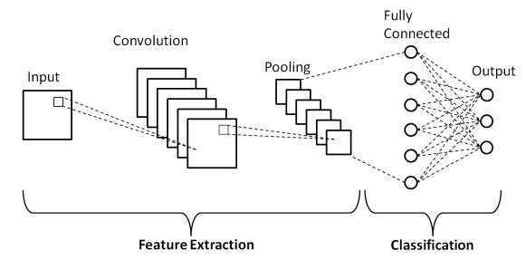
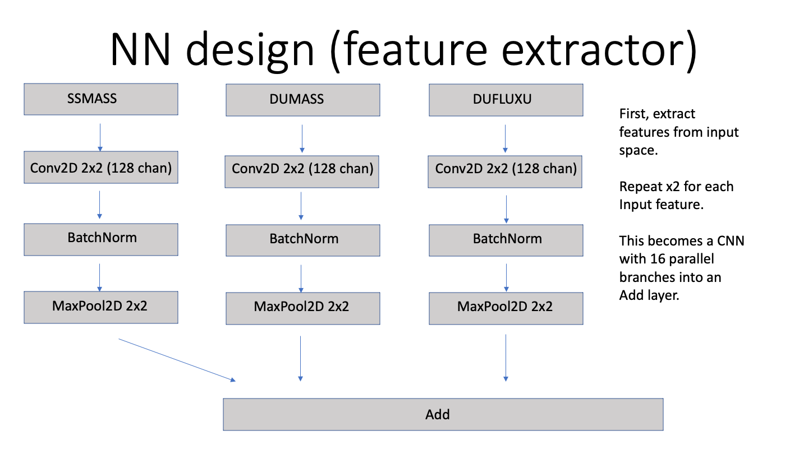

<!-- #region -->
# Open Classification of Regimes in the Southeast USA


The U.S. Department of Energy (DOE) Office of Science's AI for Earth System Predictability (AI4ESP) initiative looks to explore how various AI techniques can help improve our ability to analyze weather and climate data as well as how it can improve climate prediction. As a part of this initiative, Open Classification of Regimes in the Southeast USA (OpenCRUMS USA) is a seed effort to explore how AI can be used on reanalysis datasets to cluster reanalysis observations over U.S. DOE Atmospheric Radiation Measurement (ARM) sites. Having objective classifications of the aerosol and meteorological conditions over the ARM sites will help investigators by providing a labelled dataset for periods of interest to the investigator (i.e. polluted and pre-trough, etc.). With this, investigators studying aerosol-cloud interactions can look for cases with different aerosol loadings and synoptic forcing. 

Of particular interest to OpenCRUMS USA are Houston, TX where the DOE TRacking Aerosol Cloud Interactions ExpeRiment (TRACER) took place during Summer 2022 as well as the ARM Mobile Facility deployment in Northern Alabama that will commence in 2023. 
<!-- #endregion -->

<!-- #region -->
## Aerosol regime classification.

### Constructing the neural network

Each input from the MERRA 2 model is an input to a parallel neural network that uses a Convolutional Neural Network (CNN) for each branch corresponding to an input to extract the relevant spatial features. CNNs are Neural Networks that are designed to extract relevant spatial features from multi-dimensional spatial data. They do so by extracting features on a sliding window in the domain and then storing those features in a lower-dimensional space as demonstrated in the figure below.




Diagram is Fig 1. of Phung and Rhee (2019).

These features are then concatenated together into a single representation that is a lower-dimensional vector representation of the input data. 



These features are then an input to a classifier neural network that is composed of fully connected layers. The output of this layer is the EPA AirNow classification.

<!-- #endregion -->

## Training

The network was trained over 10 years of MERRA2 aerosol inputs. In total, 17 inputs were chosen for the CNN network. These inputs related to the mass and transport of the aerosol species available in MERRA2: Dust, sea salt, SO2, SO4, Organics, and Black Carbon column mass and horizontal fluxes.


### References
Phung, V.H.; Rhee, E.J. A High-Accuracy Model Average Ensemble of Convolutional Neural Networks for Classification of Cloud Image Patches on Small Datasets. Appl. Sci. 2019, 9, 4500. https://doi.org/10.3390/app9214500


```python

```
